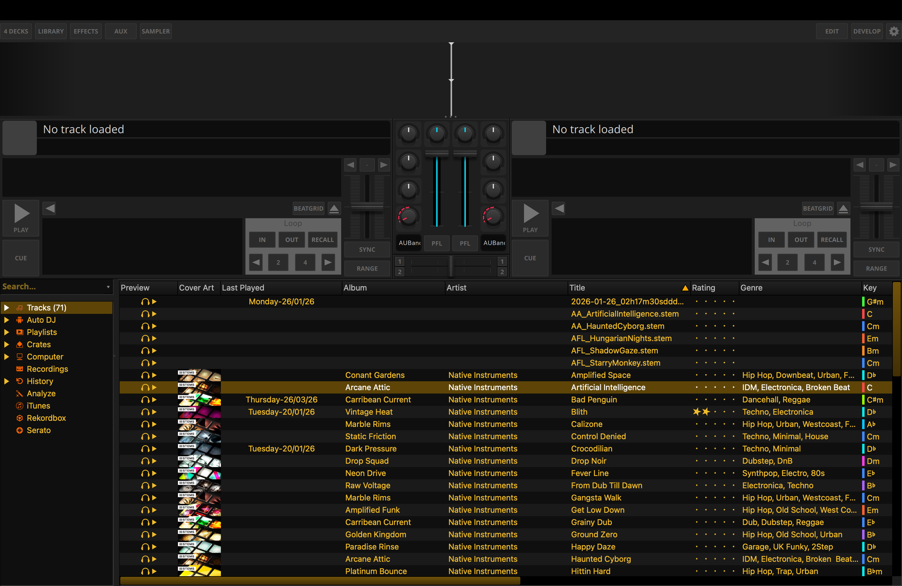

# May 13, 2026

**Total Combined Hours:** 5 hours (4.5h Library Development, 0.5h SVG Research)

## Work

### Legacy Library Embed in LateNightQML — First Usable Draft (4.5h)

- **Goal:** Reach a functional "first usable draft" of the legacy library integration within the QML skin.
- **Branch:** [`PoC-Legacy-Library-QML-Integration`](https://github.com/xARSENICx/mixxx/tree/PoC-Legacy-Library-QML-Integration)
- **Status:** Heavy development phase to achieve functional parity. This branch contains significant architectural work that isn't yet ready for upstream contribution but is essential for the project's progress.
- **Key Fixes & Improvements:**
    - **Scrollbar Fix:** Resolved coordinate mapping issues that prevented native library scrollbars from being interactive within the QML container.
    - **Sort Fix:** Enabled native header sorting by correctly forwarding mouse click events to the underlying `WTrackTableView` header.
    - **Overview Colour Fix:** Fixed the waveform overview rendering to correctly default to RGB mode instead of a monochrome fallback.
    - **Preview Fix:** Restored track preview functionality within the library rows.
    - **Mouse Hover & Resize Fix:** Implemented a custom event routing engine that emulates Qt's implicit mouse grab, allowing for smooth splitter dragging and column resizing within the QML container.
    - **Buttons QSS Fix:** Cleaned up the stylesheet (QSS) for library-embedded buttons to ensure visual consistency with the LateNight theme.
    - **Repaint & Refresh Engine:** Added a 30 FPS periodic timer to flush asynchronous widget updates (like hover states and scrollbar animations) which are normally suppressed in offscreen rendering.
    - **Style System Bridge:** Manually resolved "skins:" URL aliases and hardcoded header indicator sizes (14px) to ensure the legacy QSS renders correctly in the QML portal.

### Research — SVG Improvements in Qt 6.10 (0.5h)

- **Started research on SVG improvements in Qt 6.10.**
- Investigating how the new SVG engine can be leveraged to improve rendering performance and support more complex vector assets in LateNightQML.

## Preview

## Weekly Goals (May 11 - May 17)

- [ ] ⏳ **[Priority]** Embed legacy library in QML using the `QQuickPaintedItem` approach.
- [x] **[Priority]** Move QML from CLI flag to Skin Preferences (hidden in Developer Mode).
- [ ] **[Priority]** Pull and verify PR [#16095](https://github.com/mixxxdj/mixxx/pull/16095) to enable Qt 6.10 via vcpkg on macOS.
- [ ] Benchmark QML startup time with a single-hotcue button.
- [ ] Implement `Theme.qml` color validation and SVG existence testcase.
- [ ] ⏳ Research Qt 6.10 SVG improvements.
