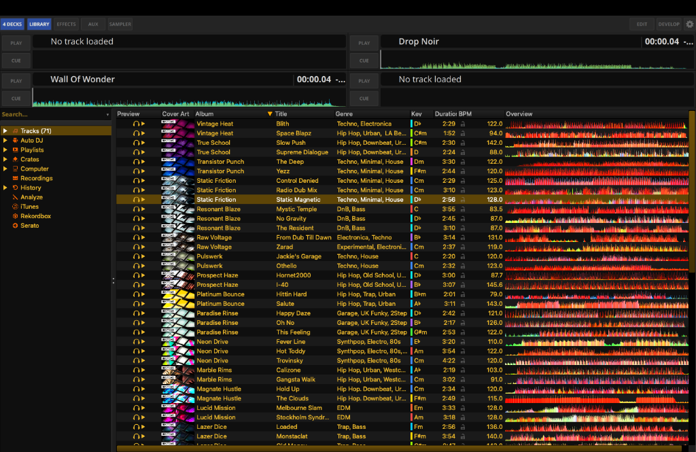

# May 16, 2026

**Total Combined Hours:** 5 hours (3h coding, 2h research & verification)

## Work

### Legacy Library Integration Fixes
- **Library Splitter Styling:** Addressed the issue with the library's vertical separator rendering white in dark mode. Renamed the legacy library splitter to `LibrarySplitter` to ensure it correctly picks up the intended QSS image fallbacks and custom styling, unifying the dark interface.
  _Commit: `3b29c7f`_

### Automated Testing
- **Skin Validation Test Case:** Wrote and verified a new comprehensive test case that validates `Theme.qml` color configurations and ensures all required SVG assets exist within the skin directory, preventing missing asset bugs in the future.
  _PR: [mixxxdj/mixxx#16464](https://github.com/mixxxdj/mixxx/pull/16464/changes)_

### PR Review & Rendering Improvements
- **Synchronous Library Rendering:** Reviewed and verified PR #1 ("Library rendering in sync"). Tested the improved performance achieved by ensuring the embedded widget rendering exactly matches the QML rendering loop via `QmlLegacyLibraryItem::eventFilter`. Also investigated the `gui_tick_50ms_period_s` assertion workaround to determine if it poses any long-term issues.
  _PR: [xARSENICx/mixxx#1](https://github.com/xARSENICx/mixxx/pull/1)_

### Qt 6.10 Research & Vcpkg PR Verification
- **PR #16095 Integration:** Pulled the vcpkg PR for Qt 6.10 locally, tested the build to verify functionality with the new framework, and brainstormed resolutions for existing issues to ensure compatibility.
- **Qt 6.10 SVG Analysis:** Authored a comprehensive research report detailing the new SVG rendering improvements introduced in Qt 6.10, explicitly analyzing how these changes will directly benefit Mixxx's UI performance and QML asset pipeline.

## Preview

### macOS PoC Screenshot

### Windows PoC Screenshot

## Tomorrow's agenda

- Investigate any remaining visual inconsistencies in the library context menus.
- Benchmark QML startup time with a single-hotcue button.

## Weekly Goals (May 11 - May 17)

- [x] **[Priority]** Embed legacy library in QML using the `QQuickPaintedItem` approach.
- [x] **[Priority]** Move QML from CLI flag to Skin Preferences (hidden in Developer Mode).
- [ ] ⏳ **[Priority]** Pull and verify PR [#16095](https://github.com/mixxxdj/mixxx/pull/16095) to enable Qt 6.10 via vcpkg on macOS.
- [ ] Benchmark QML startup time with a single-hotcue button.
- [x] Implement `Theme.qml` color validation and SVG existence testcase.
- [x] Research Qt 6.10 SVG improvements.
