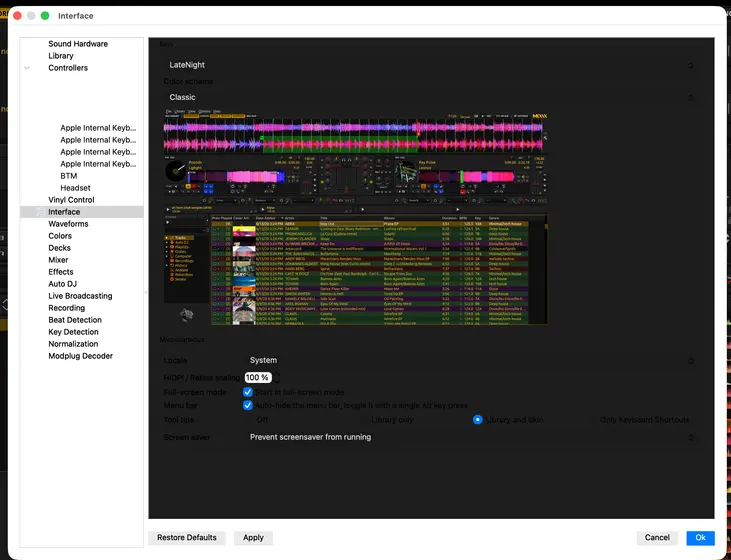

# May 17, 2026

**Total Combined Hours:** 5 hours (5h coding and testing)

## Work

### Legacy Library Integration Fixes

- **Library Search Setup:** Mirrored legacy LateNight library search setup in QML.
  _Commit: `4313b2d`_
- **Library Tooltips:** Restored legacy library tooltips functionality.
  _Commit: `f945c4d`_
- **Native Cover Art Tooltip:** Replaced the rigid custom QPainter cover art tooltip with native `QToolTip::showText()` for smoother OS-level shadows and scaling. Suppressed the visual "Fetching image..." placeholder to prevent flickering when caching images.
  _Commit: `435cfdd`_

### Preferences Fixes

- **Restore Skin Selector:** Restored the legacy skin selector in QML Mode Preferences.
  _Commit: `c3c1ace`_
- **Assertion Fixes:** Removed strict assertions (`VERIFY_OR_DEBUG_ASSERT` and `DEBUG_ASSERT`) in `DlgPrefInterface::getScreen()` that caused fatal crashes in QML mode developer builds due to the absence of `QMainWindow`. This needs to be patched better, but is just a temporary workaround.
  _Commit: `10c4590`_
  - Found this bug while testing the preferences dialog on macOS in light mode:
    

## Tomorrow's agenda

- Investigate any remaining visual inconsistencies in the library context menus.
- Address remaining mentor feedback on DPI calculation in `DlgPrefInterface::getScreen()`.

## Weekly Goals (May 11 - May 17)

- [x] **[Priority]** Embed legacy library in QML using the `QQuickPaintedItem` approach.
- [x] **[Priority]** Move QML from CLI flag to Skin Preferences (hidden in Developer Mode).
- [ ] ⏳ **[Priority]** Pull and verify PR [#16095](https://github.com/mixxxdj/mixxx/pull/16095) to enable Qt 6.10 via vcpkg on macOS.
- [x] Implement `Theme.qml` color validation and SVG existence testcase.
- [x] Research Qt 6.10 SVG improvements.

## [Long Term Goals](../long_term_goals.md)

- Benchmark QML startup time with a single-hotcue button.
