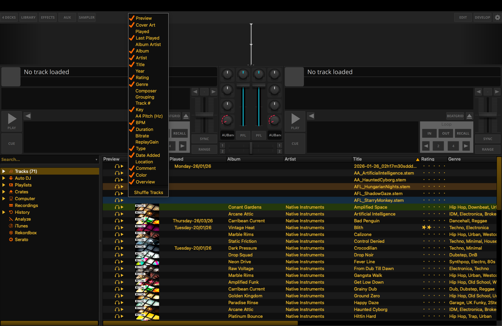
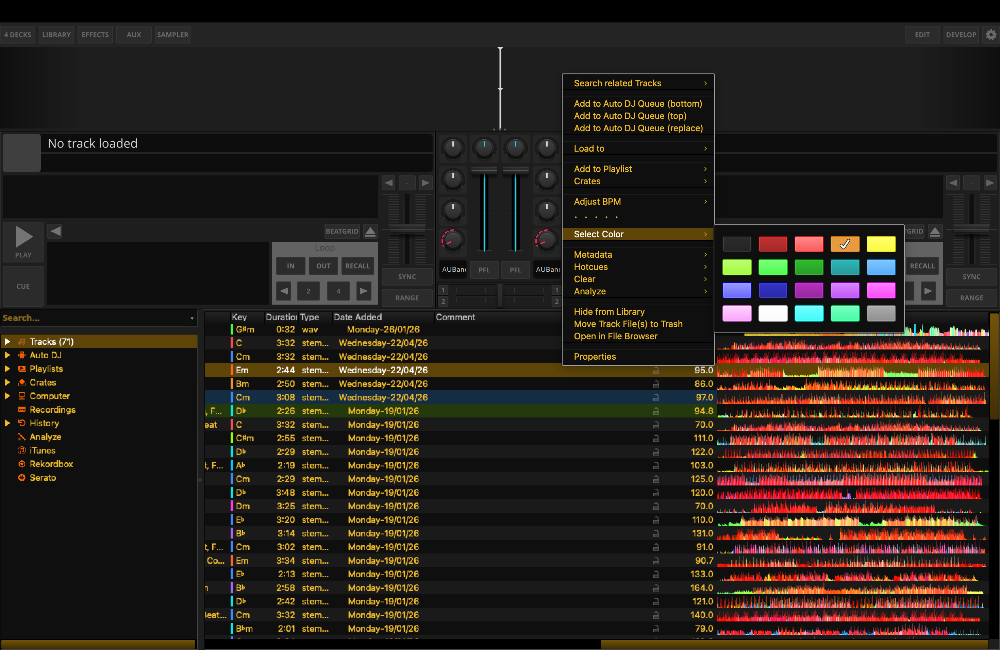
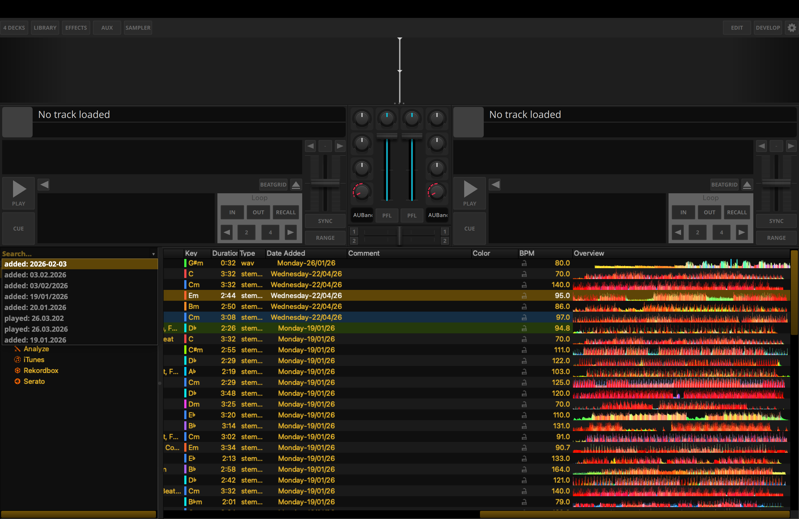
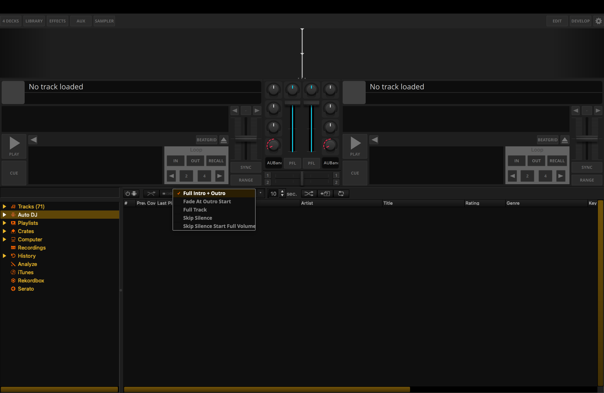

# May 14, 2026

**Total Combined Hours:** 5 hours (4.5h coding, 0.5h researching SVG)

## Work

### Legacy Library Embed in LateNightQML — Context Menus + Color/Selection Parity

**Branch:** [`PoC-Legacy-Library-QML-Integration`](https://github.com/xARSENICx/mixxx/tree/PoC-Legacy-Library-QML-Integration)

- **Context menus (LateNightQML parity with legacy):**
  Forwarded right-click context menus from the QML bridge into the embedded legacy widgets (header + track table + viewports) so the correct menus open at the click position.
  _Commit: c6d32c2cf5 (src/qml/qmllegacylibraryitem.cpp, src/qml/qmllegacylibraryitem.h)_

- **Row color / “Select Color” rendering fixes:**
  Fixed the “track color swatch vs row highlight” inconsistencies so the color cell no longer looks like a mismatched bright patch and selection/row tint behaves consistently (including around BPM lock/checkbox delegate painting).
  Restored the color picker checkmark in the embedded menu via a bridge-only sync (without breaking other LateNight styling).
  _Commit: c8c8d9c33d (src/library/tabledelegates/colordelegate.cpp, src/qml/qmllegacylibraryitem.cpp, src/qml/qmllegacylibraryitem.h)_

- **Build/CI correctness fixes:**
  Fixed Qt < 6.5 build break by handling `QDomDocument::setContent` parse result API differences.
  _Commit: b1886bb886 (src/qml/qmllegacylibraryitem.cpp)_

- **Stability:**
  Moved the offscreen render path to run on the main thread to avoid thread-safety issues with widget rendering.
  _Commit: 03bf78fa57 (src/qml/qmllegacylibraryitem.cpp, src/qml/qmllegacylibraryitem.h)_

### Skin Preferences — Alignment Fix

- Pushed the fix to let LateNightQML work with just `--developer` in [#16446](https://github.com/mixxxdj/mixxx/pull/16446).

## Preview

**Library Header Context Menu:**

Context menus correctly displayed at mouse position for headers.

**Select Color Working:**

Color selection parity and consistent row coloring.

**Dropdown Library Search:**

Dropdown popups appearing at the correct spatial position.

**Dropdown AutoDJ:**

Correct placement for AutoDJ related dropdown menus.

## Tomorrow's agenda

The `pRepaintTimer` should be replaced by an event-based approach. Because only then we can see how the performance of QML waveforms and QML animations is together with the QWidgets library.

## Weekly Goals (May 11 - May 17)

- [ ] ⏳ **[Priority]** Embed legacy library in QML using the `QQuickPaintedItem` approach.
- [x] **[Priority]** Move QML from CLI flag to Skin Preferences (hidden in Developer Mode).
- [ ] **[Priority]** Pull and verify PR [#16095](https://github.com/mixxxdj/mixxx/pull/16095) to enable Qt 6.10 via vcpkg on macOS.
- [ ] Benchmark QML startup time with a single-hotcue button.
- [ ] Implement `Theme.qml` color validation and SVG existence testcase.
- [x] Research Qt 6.10 SVG improvements.
